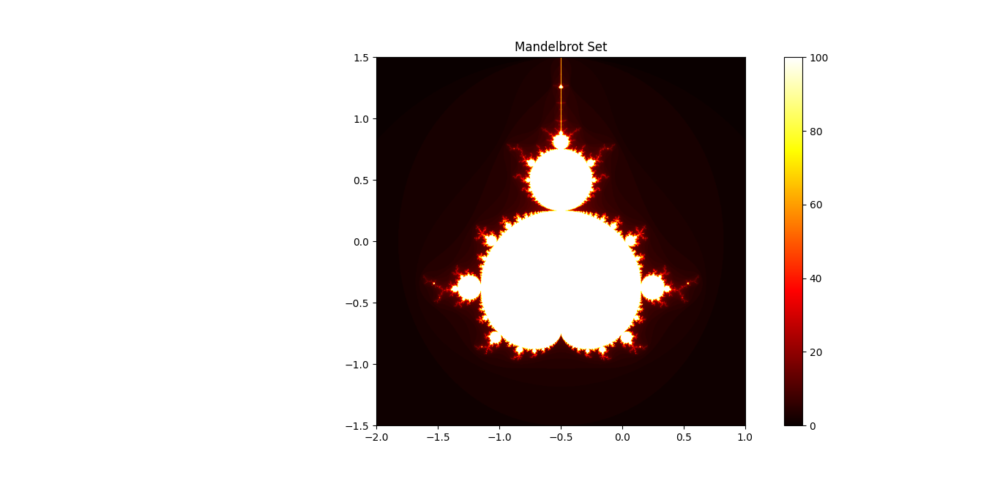

# Mandelbrot Set



This repository contains a Python implementation to graph and visualize the Mandelbrot Set, a famous fractal representing the set of complex numbers that remain bounded under iterative functions.

## What is the Mandelbrot Set?

The Mandelbrot Set is the set of complex numbers, `c`, for which the function:

```
zₙ₊₁ = zₙ² + c
```

remains bounded (does not go to infinity) when iterated from `z₀ = 0`. Points in the set produce beautiful fractal patterns when visualized.

## Features

- Generate and plot the Mandelbrot Set using Python.
- Customize graph size and range for exploration.
- Adjustable iteration depth to refine detail.
- Easy visualization using `matplotlib`.

## Installation

1. Clone this repository:
   ```bash
   git clone https://github.com/your-username/mandelbrot-set.git
   cd mandelbrot-set
   ```

2. Install the required dependencies:
   ```bash
   pip install numpy matplotlib
   ```

## Usage

Run the script to generate and display the Mandelbrot Set:

```bash
python main.py
```

The program will display a plot of the Mandelbrot Set using `matplotlib`.

### Customize the Graph

- You can adjust the graph's **real and imaginary ranges** by changing the values in the code:
  ```python
  real_min, real_max = -2, 1
  imag_min, imag_max = -1.5, 1.5
  ```
- You can increase the **number of iterations** to refine the fractal details:
  ```python
  max_iter = 100
  ```

## Example Output


The generated Mandelbrot Set fractal will display different regions of the complex plane.

## How It Works

1. For each point `c` in the complex plane, the function `zₙ₊₁ = zₙ² + c` is iterated starting from `z₀ = 0`.
2. If the magnitude of `z` exceeds 2 at any point, it is considered to be outside the Mandelbrot Set.
3. The points that remain bounded are part of the Mandelbrot Set and are visualized on the graph.

## Contributing

Contributions are welcome! Feel free to submit a pull request or open an issue if you find bugs or have ideas for improvements.

## License

This project is licensed under the Apache 2.0 License. See the [LICENSE](LICENSE) file for details.
